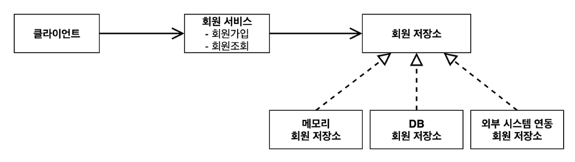
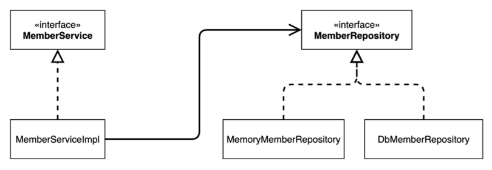
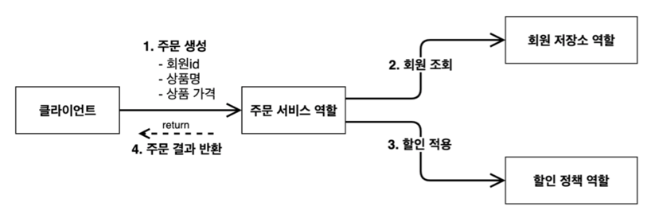
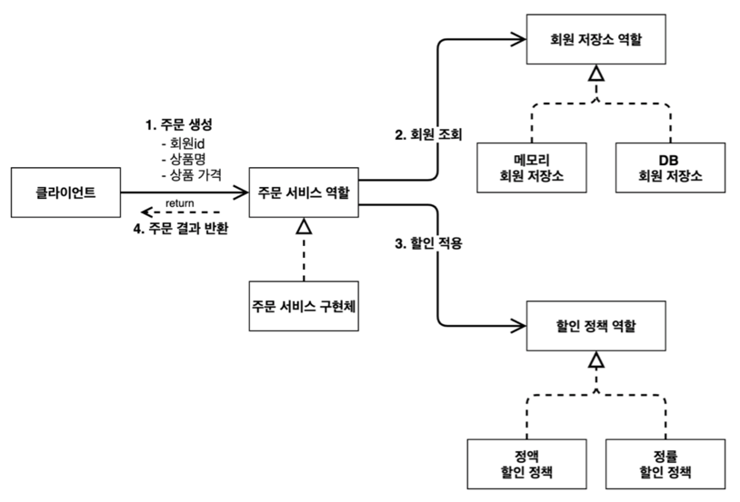
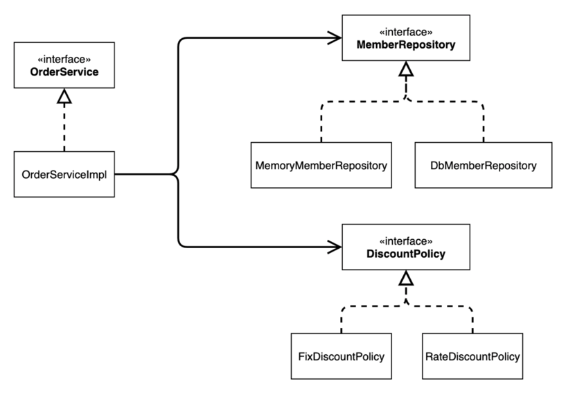
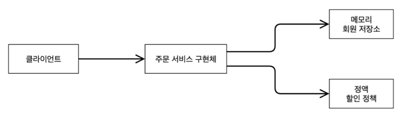
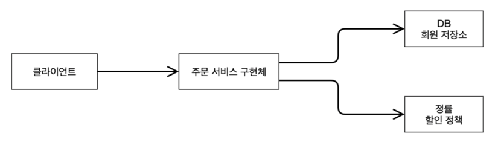

# spring-core-basic-pjt
Inflearn 스프링 핵심 원리 기본편의 실습 프로젝트를 기록한 것입니다.

## 구현방식

### 순수 JAVA

- IDE : IntelliJ
- Project : Gradle
- Spring Boot : 2.7.5
- Languge : JAVA
- Packaging : Jar
- Java : 11

## 비즈니스 요구사항과 설계
- 회원
  - 회원을 가입하고 조회할 수 있다.
  - 회원은 일반 / VIP 등급이 있다.
  - 회원 데이터는 자체 DB를 구축할 수 있고, 외부 시스템과 연동할 수도 있다.
- 주문과 할인 정책
  - 회원은 상품을 주문할 수 있다.
  - 회원 등급에 따라 할인 정책을 적용할 수 있다.
  - VIP는 1000원을 할인해주는 고정 금액 할인을 적용한다.
  - 할인 정책은 변경 가능성이 높다. 최악의 경우 할인을 적용하지 않을 수도 있다.

### 회원 도메인 설계 
#### 회원 도메인 협력 관계
  
  
#### 회원 클래스 다이어그램

#### 회원 객체 다이어그램

- 회원 서비스 : MemberServiceImpl

### 주문과 할인 도메인 설계
#### 주문 도메인 협력, 역할, 책임

1. 주문 생성 : 클라이언트는 주문 서비스에 주문 생성을 요청한다.
2. 회원 조회 : 할인을 위해서는 회원 등급이 필요하다. 그래서 주문 서비스는 저장소에서 회원을 조회한다.
3. 할인 적용 : 주문 서비스는 회원 등급에 따른 할인 여부를 할인 정책에 위임한다.
4. 주문 결과 반환 : 주문 서비스는 할인 결과를 포함한 주문 결과를 반환한다. (단순히 반환까지만 구현하도록 한다.)

#### 주문 도메인 전체

<b>역할과 구현을 분리</b>해서 자유롭게 구현 객체를 조립할 수 있게 설계했다.  
덕분에 유연하게 변경할 수 있다는 장점이 있다.

#### 주문 도메인 클래스 다이어그램

#### 주문 도메인 객체 다이어그램 1

#### 주문 도메인 객체 다이어그램 2
